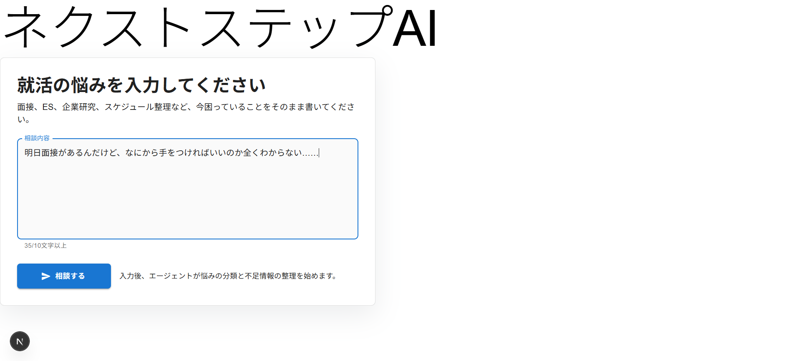
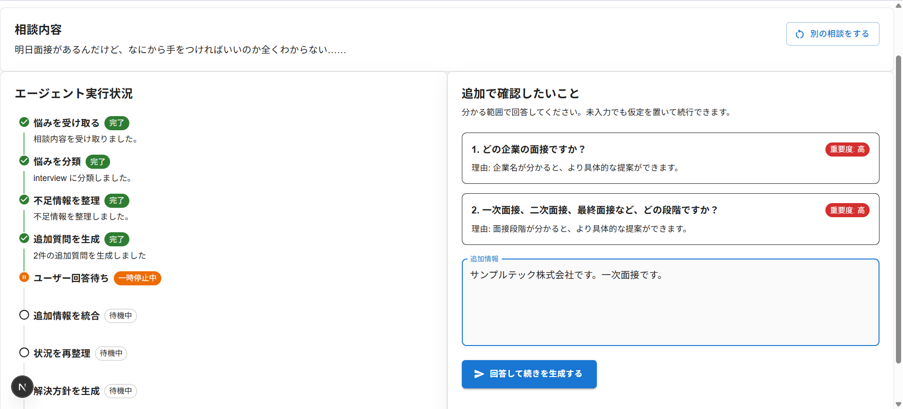
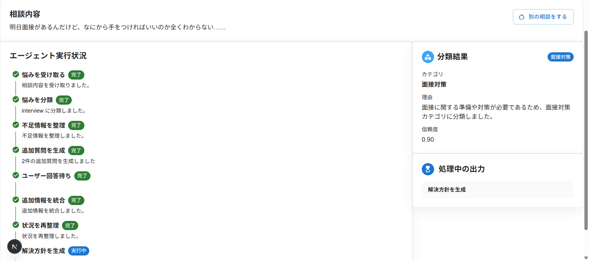
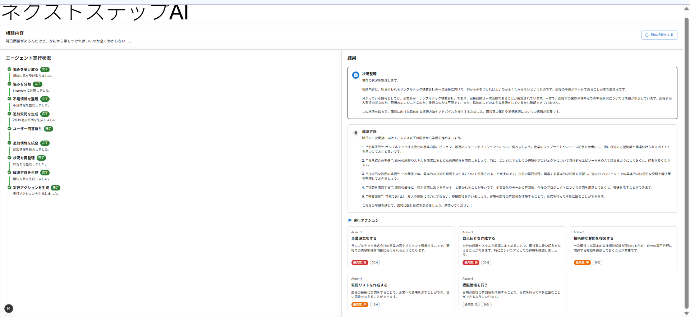

# ネクストステップAI

ネクストステップAIは、就職活動やインターン準備に関する悩みを入力すると、AIエージェントが悩みの分類、不足情報の整理、追加質問、解決方針、実行アクションの提案を行うWebアプリケーションです。

このアプリケーションは、実用サービスとしての完成度を目指したものではなく、インターンに向けた事前学習を主目的として開発しました。特に、Next.jsによるフロントエンド・API実装と、LangGraphによるAIエージェントの処理フロー設計を学ぶための練習用プロジェクトです。

また、本プロジェクトのコードは半分以上をAIコーディング支援によって実装しています。AIに任せきりにするのではなく、要件整理、設計判断、生成コードの確認・修正を行いながら、AIを活用した開発プロセスそのものを学ぶ目的も含んでいます。

本アプリは学習用MVPであり、実際の就職活動における意思決定を支援する品質検証は行っていません。生成される助言の正確性、有効性、実在企業や実際の選考情報に対する妥当性を保証するものではありません。

## 画面例

以下には、公開用の架空データを使ったスクリーンショットを掲載する想定です。実在企業や実際の選考情報に対する助言品質を検証するものではなく、入力から分類、追加質問、方針生成、アクション提案までのUIと処理フローを示すための画面例です。






## 主な機能

- 就活・インターン準備に関する悩みの入力
- 悩みカテゴリの分類
- 不足情報の分析
- 必要に応じた追加質問の生成
- 追加情報を踏まえた状況整理
- 解決方針の生成
- 具体的な実行アクションの提案
- AIエージェントの処理状況をタイムラインで表示

## 技術スタック

- Next.js 16.2.9
- React 19.2.4
- TypeScript
- MUI
- LangGraph.js
- LangChain OpenAI
- OpenAI API
- Zod
- Tailwind CSS
- ESLint
- Prettier

## アプリケーション構成

```text
app/
  page.tsx                         画面のエントリーポイント
  api/advice/stream/route.ts       AIエージェント用のストリーミングAPI

src/
  components/                      UIコンポーネント
  hooks/                           画面状態とエージェント実行用の hooks
  lib/agent/                       LangGraph のグラフ定義
  lib/nodes/                       各エージェント処理ノード
  lib/llm/                         OpenAI クライアント生成
  types/                           型定義

docs/
  ネクストステップAI_要件定義・仕様書.md
  ワイヤーフレーム.jpg
```

## AIエージェントの処理フロー

1. ユーザーの悩みを受け取る
2. 悩みのカテゴリを分類する
3. 不足している情報を分析する
4. 必要な場合は追加質問を生成する
5. 追加情報を統合する
6. 状況を整理する
7. 解決方針を生成する
8. 実行アクションを生成する

初回入力だけで十分な情報がある場合は、そのまま方針とアクション生成に進みます。不足情報がある場合は、ユーザーに追加質問を提示し、回答後に最終的な提案を生成します。

## API概要

### `POST /api/advice/stream`

AIエージェントの処理結果をNDJSON形式でストリーミング返却します。

初回リクエスト:

```ts
{
  initialConcern: string;
}
```

追加回答リクエスト:

```ts
{
  state: JobHuntAdviceState;
  additionalInfo?: string;
}
```

主なイベント:

- `step_started`
- `step_completed`
- `step_skipped`
- `needs_user_input`
- `partial_result`
- `completed`
- `error`

## セットアップ

依存関係をインストールします。

```bash
npm install
```

`.env.local` にOpenAI APIキーを設定します。

```text
OPENAI_API_KEY=your_api_key
```

開発サーバーを起動します。

```bash
npm run dev
```

ブラウザで以下を開きます。

```text
http://localhost:3000
```

## 開発用コマンド

```bash
npm run dev
npm run build
npm run start
npm run lint
```

## 現在のスコープ

このプロジェクトは学習用MVPのため、以下は実装対象外です。

- ユーザー認証
- データベース保存
- 相談履歴の永続化
- Web検索
- RAG
- カレンダー連携
- 本番運用向けの詳細なセキュリティ設計

## 開発目的

このプロジェクトで特に学習したかった点は以下です。

- Next.js App Routerでの画面実装
- Next.js Route HandlerによるAPI実装
- Streaming Responseを使った進行状況の表示
- LangGraphによるAIエージェントの状態管理
- LangChainとOpenAI APIの連携
- TypeScriptによる型定義と状態設計
- AIコーディング支援を使った開発フロー
