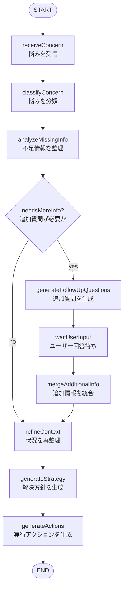
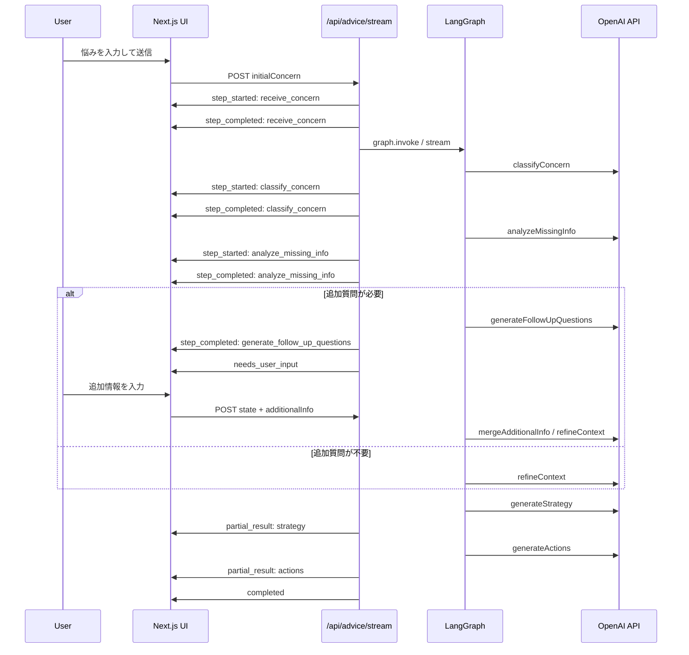

# 要件定義・仕様書 v1.1.0

## 1. ドキュメント情報

| 項目 | 内容 |
|---|---|
| ドキュメント名 | 要件定義・仕様書 |
| バージョン | 1.1.0 |
| アプリ名 | ネクストステップAI |
| アプリ種別 | 就活課題整理エージェント |
| 想定用途 | ワンキャリア 3days インターンに向けた練習アプリ |
| 作成目的 | Next.js、LangGraph、OpenAI API を用いたAIエージェント開発の事前練習 |

## 1.1 変更履歴

| バージョン | 変更内容                                                                                            |
| ----- | ----------------------------------------------------------------------------------------------- |
| 0.1.0 | 初版。MVP範囲、分類設計、追加質問設計、LangGraph構成を定義                                                             |
| 0.2.0 | 実装言語をTypeScriptに統一。個人開発ではOpenAI APIを使用する方針に変更。MUI Icons、ESLintを採用。React Hook Form、dotenvを不採用に変更 |
| 0.3.0 | 1画面構成におけるエージェント実行状況表示を追加。ストリーミングAPI、進行状況イベント、画面状態遷移、追加質問時の一時停止仕様を追加                             |
| 1.0.0 | 練習用アプリとして仕様を確定。OpenAI API固定に変更。ストリーミングAPIを主APIとして整理。LangGraph設計をMermaid形式に変更                    |
| 1.1.0 | アプリ名称を「ネクストステップAI」に決定。ドキュメント情報、アプリ概要、画面仕様上の表示名に反映                                               |
| 1.2.0 | GitHub及びワイヤーフレームへのリンクを追記                                                                        |

## 2. アプリ概要

本アプリ「ネクストステップAI」は、就活生が抱える悩みを入力すると、AIエージェントが悩みの種類を分類し、不足情報を整理したうえで、解決方針と実行アクションを提示するWebアプリケーションである。

単なるチャットボットではなく、悩みの分類結果に応じて追加質問、プロンプト、解決方針の観点を切り替えることで、就活相談に特化した支援プロセスを提供する。

本アプリは、本番運用やハッカソン当日の持ち込みを目的とするものではなく、インターン前にAIエージェント実装を事前練習するためのMVPとする。

- Next.js による画面実装
- Next.js API Route によるバックエンド処理
- OpenAI API の呼び出し
- LangGraph による状態管理・処理分岐
- AIエージェントを用いたプロダクト設計

## 3. 開発背景

ワンキャリアのインターンでは、ハッカソン形式で「就活の課題を解決するプロダクトをAIエージェントを用いて開発する」ことが想定されている。本アプリは、その本番成果物として持ち込むものではなく、類似する技術要素を事前に練習するための独立したアプリケーションである。

推奨技術として Next.js と LangGraph が提示されているが、事前時点ではいずれも実務・個人開発での使用経験がない。そのため、インターン本番前に、最小構成でAIエージェント型アプリケーションを実装し、技術的な詰まりどころを把握しておく必要がある。

特に、LangGraphについては、単にLLMを呼び出すだけでなく、分類、状態更新、条件分岐、追加質問、最終出力生成といった複数ステップの処理を扱うことが重要である。

## 4. 目的

本アプリの目的は以下の通りである。

1. 就活相談を題材に、AIエージェントの基本構造を実装する
2. LangGraph による状態管理・分岐処理を体験する
3. Next.js と OpenAI API を用いたMVP開発に慣れる
4. 類似テーマのAIエージェント型アプリを自力で縦に1本通せる状態を作る
5. 分類・追加質問・解決方針生成・アクション生成の一連の流れを把握する

## 5. MVPスコープ

### 5.1 MVPで実装する範囲

本バージョンでは、以下をMVP範囲とする。

- ユーザーが就活の悩みを入力できる
- 入力内容をAIが分類できる
- 分類結果に応じて不足情報を整理できる
- 重要な不足情報がある場合、追加質問を表示できる
- ユーザーが追加情報を入力できる
- 初期入力と追加情報を統合して状況を再整理できる
- 解決方針を生成できる
- 実行アクションを生成できる
- 画面上に分類結果、状況整理、解決方針、実行アクションを表示できる
- エージェントの処理状況をステップ単位で画面に逐次表示できる
- ストリーミングAPIにより、分類・不足情報整理・追加質問生成・方針生成・アクション生成の進行状況をクライアントへ送信できる

### 5.2 MVPで実装しない範囲

本バージョンでは、以下は実装対象外とする。

- ユーザー認証
- DB保存
- 過去相談履歴の保存
- カレンダー連携
- Web検索
- RAG
- 企業情報データベース連携
- PDF出力
- チャット履歴の永続化
- 本番運用向けのセキュリティ設計
- 複雑なUIアニメーション

## 6. 想定ユーザー

### 6.1 メインユーザー

就活中の学生。

特に以下のようなユーザーを想定する。

- 就活準備で何をすべきか分からない学生
- ES、面接、企業研究、インターン準備などに不安がある学生
- 複数の選考や締切を抱えており、優先順位を整理したい学生
- 自分の悩みをうまく言語化できていない学生

### 6.2 利用シーン

- 面接前に準備すべきことを整理したい
- ESの書き方に迷っている
- 企業研究で何を調べるべきか分からない
- インターンや選考の準備方針を立てたい
- 締切やタスクが多く、今日何をすべきか判断したい

## 7. 基本ユーザーフロー

本アプリの基本フローは以下とする。

1. ユーザーが就活の悩みを入力する
2. 入力フォームを相談内容カードに変換し、エージェント実行状況を表示する
3. エージェントが悩みを受信したことを画面に表示する
4. エージェントが悩みを分類し、分類結果を途中経過として表示する
5. エージェントが不足情報を整理し、整理結果を途中経過として表示する
6. 重要な不足情報がある場合、追加質問を表示し、エージェント処理を一時停止する
7. ユーザーが追加情報を入力する
8. エージェントが初期入力と追加情報を統合し、状況を再整理する
9. エージェントが解決方針を生成する
10. エージェントが実行アクションを生成する
11. ユーザーに結果を表示する

本バージョンでは、エージェントの処理状況を「最終結果が出るまで隠す」のではなく、処理ステップごとに画面へ逐次表示する。

これにより、ユーザーはAIエージェントがどのような手順で結論に到達したのかを確認できる。

## 8. 悩み分類

### 8.1 分類の目的

悩みを分類する目的は、ユーザー入力にラベルを付けること自体ではない。

分類結果をもとに、以下を切り替えることが目的である。

- 追加質問の観点
- 使用するプロンプト
- 状況整理の観点
- 解決方針の生成方針
- 実行アクションの粒度
- 出力フォーマット

つまり、分類は「どの支援プロセスに乗せるか」を決めるための処理である。

### 8.2 分類一覧

MVPでは、以下のカテゴリを扱う。

| category | 表示名 | 例 | 主な支援内容 |
|---|---|---|---|
| self_analysis | 自己分析 | 強みが分からない、ガクチカが弱い | 経験整理、強み抽出、エピソード整理 |
| application_documents | ES・応募書類 | 志望動機が書けない、自己PRを直したい | 構成提案、論理補強、企業との接続 |
| interview | 面接対策 | 面接で何を話せばいいか不安 | 想定質問、深掘り、回答方針 |
| company_research | 企業研究 | 企業の何を調べればいいか分からない | 調査観点、比較軸、志望理由化 |
| internship_selection | インターン・選考対策 | ハッカソン準備、グループワーク対策 | 事前準備、立ち回り、評価軸整理 |
| schedule_priority | スケジュール・優先順位 | 締切が多い、どれを優先すべきか分からない | タスク分解、優先順位、今日やること |
| career_choice | キャリア選択 | どの職種・企業が合うか分からない | 価値観整理、選択基準、比較 |
| other | その他 | 上記に明確に当てはまらない悩み | 汎用的な状況整理とアクション提示 |

### 8.3 分類結果の出力仕様

分類ノードは以下の形式で結果を返す。

```ts
export type ConcernCategory =
  | "self_analysis"
  | "application_documents"
  | "interview"
  | "company_research"
  | "internship_selection"
  | "schedule_priority"
  | "career_choice"
  | "other";

export type ClassificationResult = {
  category: ConcernCategory;
  subCategory?: string;
  confidence: number;
  reason: string;
};
```

## 9. 追加質問設計

### 9.1 基本方針

追加質問は、完全にLLM任せにはしない。

基本方針は以下とする。

- 質問すべき観点は開発者が定義する
- ユーザー入力から既知情報を抽出する処理はLLMに任せる
- 不足している情報の判定は、LLMの抽出結果とアプリ側の設定を組み合わせて行う
- 実際の質問文は、定義済みの質問文をそのまま使うか、LLMに自然な表現へ整形させる
- 追加質問は最大3つまでとする

### 9.2 RequiredField型

```ts
export type RequiredField = {
  key: string;
  label: string;
  question: string;
  importance: "high" | "medium" | "low";
};
```

### 9.3 面接対策カテゴリの必要情報

```ts
export const interviewRequiredFields: RequiredField[] = [
  {
    key: "companyName",
    label: "企業名",
    question: "どの企業の面接ですか？",
    importance: "high",
  },
  {
    key: "interviewStage",
    label: "面接段階",
    question: "一次面接、二次面接、最終面接など、どの段階ですか？",
    importance: "high",
  },
  {
    key: "interviewerType",
    label: "面接官の属性",
    question: "面接官は人事、現場エンジニア、役員など、分かっていますか？",
    importance: "medium",
  },
  {
    key: "interviewDate",
    label: "面接日",
    question: "面接日はいつですか？",
    importance: "high",
  },
  {
    key: "mainConcern",
    label: "主な不安",
    question: "特に不安な質問や場面はありますか？",
    importance: "high",
  },
  {
    key: "preparedSoFar",
    label: "準備状況",
    question: "現時点でどこまで準備していますか？",
    importance: "medium",
  },
];
```

### 9.4 ES・応募書類カテゴリの必要情報

```ts
export const applicationDocumentRequiredFields: RequiredField[] = [
  {
    key: "companyName",
    label: "企業名",
    question: "どの企業に提出するES・応募書類ですか？",
    importance: "high",
  },
  {
    key: "questionText",
    label: "設問文",
    question: "ESや応募書類の設問文を教えてください。",
    importance: "high",
  },
  {
    key: "wordLimit",
    label: "文字数制限",
    question: "文字数制限はありますか？",
    importance: "medium",
  },
  {
    key: "draft",
    label: "現在の下書き",
    question: "現在の下書きがあれば貼ってください。",
    importance: "medium",
  },
  {
    key: "experience",
    label: "使いたい経験",
    question: "回答に使いたい経験はありますか？",
    importance: "high",
  },
];
```

### 9.5 スケジュール・優先順位カテゴリの必要情報

```ts
export const scheduleRequiredFields: RequiredField[] = [
  {
    key: "deadlines",
    label: "締切一覧",
    question: "直近の締切や面接日程を教えてください。",
    importance: "high",
  },
  {
    key: "availableTime",
    label: "使える時間",
    question: "今日または今週、就活準備に使える時間はどれくらいですか？",
    importance: "high",
  },
  {
    key: "priorityCompanies",
    label: "優先企業",
    question: "特に優先したい企業はありますか？",
    importance: "medium",
  },
  {
    key: "currentTasks",
    label: "現在のタスク",
    question: "今やらなければいけない就活タスクを分かる範囲で教えてください。",
    importance: "high",
  },
];
```

### 9.6 追加質問の生成ルール

追加質問の生成ルールは以下とする。

1. カテゴリごとの requiredFields を取得する
2. ユーザー入力から、各fieldに該当する情報が存在するか抽出する
3. high importance かつ未入力の項目を優先する
4. 最大3件まで質問する
5. 追加質問が不要な場合は、そのまま解決方針生成へ進む
6. 不足しているが必須でない情報については、仮定を明示して処理を進める

### 9.7 不足情報の扱い

不足情報の扱いは以下の3種類とする。

```ts
export type MissingInfoHandling =
  | "ask_user"
  | "assume_and_continue"
  | "ignore";
```

| handling | 内容 |
|---|---|
| ask_user | ユーザーに追加質問する |
| assume_and_continue | 仮定を置いて処理を進める |
| ignore | MVPでは扱わない |

## 10. LangGraph設計

### 10.1 グラフ全体像

LangGraphの処理構造は以下とする。



### 10.2 ストリーミングイベントとの対応

各ノードの開始・完了時に、ストリーミングAPIから進行状況イベントを送信する。



### 10.3 ノード一覧

| ノード名 | 役割 | 対応する進行状況ID |
|---|---|---|
| receiveConcern | ユーザーの悩みを受信し、状態に格納する | receive_concern |
| classifyConcern | ユーザーの悩みをカテゴリ分類する | classify_concern |
| analyzeMissingInfo | カテゴリごとの必要情報に対して、既知情報と不足情報を整理する | analyze_missing_info |
| needsMoreInfo | 追加質問が必要か判定する | なし |
| generateFollowUpQuestions | ユーザーに聞く追加質問を生成する | generate_follow_up_questions |
| waitUserInput | ユーザー回答待ちとして処理を一時停止する | wait_user_input |
| mergeAdditionalInfo | 初期入力と追加情報を統合する | merge_additional_info |
| refineContext | 現在の情報をもとに状況を再整理する | refine_context |
| generateStrategy | 状況に応じた解決方針を生成する | generate_strategy |
| generateActions | ユーザーが実行すべきアクションを生成する | generate_actions |

### 10.4 状態定義

```ts
export type Action = {
  title: string;
  reason: string;
  priority: "high" | "medium" | "low";
  estimatedMinutes?: number;
};

export type MissingInfo = {
  key: string;
  label: string;
  question: string;
  importance: "high" | "medium" | "low";
  handling: MissingInfoHandling;
  assumption?: string;
};

export type JobHuntAdviceState = {
  initialConcern: string;
  category?: ConcernCategory;
  subCategory?: string;
  classificationReason?: string;
  confidence?: number;

  extractedInfo?: Record<string, string | null>;
  missingInfo?: MissingInfo[];
  followUpQuestions?: FollowUpQuestion[];
  additionalInfo?: string;

  refinedContext?: string;
  strategy?: string;
  actions?: Action[];
};
```

## 11. プロンプト設計

### 11.1 分類プロンプト

目的は、ユーザーの悩みを定義済みカテゴリのいずれかに分類することである。

出力は `ClassificationResult` に従う。

分類時には以下を重視する。

- ユーザーが直接求めている支援内容
- 最終的に生成すべきアクションの種類
- 必要になる追加質問の種類

### 11.2 不足情報整理プロンプト

目的は、カテゴリごとの requiredFields に対して、ユーザー入力から既に分かっている情報を抽出することである。

LLMは以下を返す。

```ts
export type ExtractedInfoResult = {
  extractedInfo: Record<string, string | null>;
};
```

### 11.3 解決方針生成プロンプト

分類結果に応じて、プロンプトの役割を変える。

#### 面接対策

```text
あなたはエンジニア就活の面接対策アドバイザーです。
ユーザーの状況を整理し、面接で見られそうな観点、準備方針、深掘りされそうな点を提案してください。
```

#### ES・応募書類

```text
あなたはエントリーシート添削アドバイザーです。
ユーザーの経験と応募先企業・設問の意図を接続し、主張、構成、改善観点を提案してください。
```

#### スケジュール・優先順位

```text
あなたは就活タスク管理アドバイザーです。
締切、重要度、所要時間をもとに、ユーザーが今やるべきことを優先順位付けしてください。
```

#### 汎用

```text
あなたは就活支援アドバイザーです。
ユーザーの悩みを整理し、現実的に実行できる解決方針と次のアクションを提示してください。
```

## 12. 画面仕様

### 12.1 画面設計方針

本バージョンでは、画面遷移を増やさず、1画面内で相談入力、エージェント実行状況、追加質問、最終結果を段階的に表示する。

基本方針は以下とする。

- 送信前は入力フォームを表示する
- 送信後は入力フォームを消し、相談内容カードとして表示する
- エージェント実行状況は、送信後に出現する
- エージェント実行状況は、処理完了後も消さずに残す
- 最終結果は、エージェント実行状況の下に表示する
- 追加質問が必要な場合は、実行状況の途中で処理を一時停止し、追加質問フォームを表示する

### 12.2 画面状態

画面全体の状態は以下で管理する。

```ts
export type AppPhase =
  | "idle"
  | "running_initial_analysis"
  | "waiting_for_user"
  | "running_final_generation"
  | "completed"
  | "error";
```

| AppPhase | 内容 | 表示する主なUI |
|---|---|---|
| idle | 初期状態 | 初期相談入力エリア |
| running_initial_analysis | 初回分析中 | 相談内容カード、エージェント実行状況 |
| waiting_for_user | 追加質問への回答待ち | 相談内容カード、エージェント実行状況、追加質問フォーム |
| running_final_generation | 追加情報統合後、最終生成中 | 相談内容カード、エージェント実行状況、生成中の結果エリア |
| completed | 完了 | 相談内容カード、エージェント実行状況、最終結果エリア |
| error | エラー | 相談内容カード、エージェント実行状況、エラー表示 |

### 12.3 画面レイアウト

#### idle状態

```text
┌─────────────────────────────┐
│ ネクストステップAI            │
│ 説明文                       │
│ [悩み入力欄]                 │
│ [相談する]                   │
└─────────────────────────────┘
```

#### running / waiting / completed状態

```text
┌─────────────────────────────┐
│ 相談内容                     │
│ ユーザーが入力した悩み        │
│ [別の相談をする]             │
└─────────────────────────────┘

┌─────────────────────────────┐
│ エージェント実行状況          │
│ ✓ 悩みを受信                 │
│ ✓ 面接対策に分類             │
│ ● 不足情報を整理中           │
│ ○ 解決方針を生成             │
└─────────────────────────────┘

┌─────────────────────────────┐
│ 追加質問 / 結果               │
│ 状態に応じて切り替え          │
└─────────────────────────────┘
```

### 12.4 コンポーネント構成

```text
app/page.tsx
  ├─ ConcernInput
  ├─ ConcernSummaryCard
  ├─ AgentProgressTimeline
  ├─ FollowUpQuestionPanel
  ├─ ResultPanel
  └─ ErrorPanel
```

| コンポーネント | 役割 | 表示条件 |
|---|---|---|
| ConcernInput | 初期相談の入力 | `AppPhase === "idle"` |
| ConcernSummaryCard | 送信済み相談内容の表示 | `AppPhase !== "idle"` |
| AgentProgressTimeline | エージェント処理状況の表示 | `AppPhase !== "idle"` |
| FollowUpQuestionPanel | 追加質問と回答欄の表示 | `AppPhase === "waiting_for_user"` |
| ResultPanel | 状況整理、解決方針、実行アクションの表示 | `strategy` または `actions` が存在する場合 |
| ErrorPanel | エラー表示、再試行導線 | `AppPhase === "error"` |

### 12.5 初期相談入力エリア

#### 表示項目

- アプリタイトル「ネクストステップAI」
- アプリ説明文
- 悩み入力用テキストエリア
- 送信ボタン

#### 入力項目

| 項目 | 型 | 必須 | 備考 |
|---|---|---|---|
| initialConcern | string | 必須 | ユーザーの就活相談本文 |

#### バリデーション

- 空文字の場合は送信不可
- 10文字未満の場合は、もう少し具体的に入力するよう促す

#### 送信後の扱い

送信後、入力欄は非表示にする。

ただし、入力内容は `ConcernSummaryCard` として画面上に残す。

入力欄をdisabled状態で残すのではなく、相談内容の要約カードとして表示することで、フォームのノイズを減らし、エージェント実行状況に視線を移しやすくする。

### 12.6 相談内容カード

送信後に表示する。

#### 表示項目

- 見出し「相談内容」
- ユーザーが入力した悩み本文
- 「別の相談をする」ボタン

#### 操作

| 操作 | 内容 |
|---|---|
| 別の相談をする | 現在の状態を破棄し、`idle` に戻す |

### 12.7 エージェント実行状況表示

本アプリでは、ユーザーがAIエージェントの処理内容を理解できるように、各処理ステップの進行状況を画面に表示する。

表示対象のステップは以下とする。

1. 悩みの受信
2. 悩みの分類
3. 不足情報の整理
4. 追加質問の生成
5. ユーザー回答待ち
6. 追加情報の統合
7. 状況の再整理
8. 解決方針の生成
9. 実行アクションの生成

各ステップには以下の状態を持たせる。

```ts
export type AgentStepStatus =
  | "waiting"
  | "running"
  | "completed"
  | "paused"
  | "skipped"
  | "error";
```

```ts
export type AgentProgressStep = {
  id:
    | "receive_concern"
    | "classify_concern"
    | "analyze_missing_info"
    | "generate_follow_up_questions"
    | "wait_user_input"
    | "merge_additional_info"
    | "refine_context"
    | "generate_strategy"
    | "generate_actions";
  label: string;
  status: AgentStepStatus;
  summary?: string;
};
```

#### 表示例

```text
エージェント実行状況

✓ 悩みを受け取りました
✓ 面接対策に分類しました
✓ 不足情報を整理しました
⏸ 追加情報の回答待ち
○ 状況を再整理
○ 解決方針を生成
○ 実行アクションを生成
```

#### 表示ルール

- `running` のステップは進行中として表示する
- `completed` のステップは完了状態として表示する
- `paused` のステップはユーザー入力待ちとして表示する
- `summary` が存在する場合、ステップ下に短い説明として表示する
- 完了後もタイムラインは非表示にせず、処理ログとして残す

### 12.8 分類結果カード

分類完了時点で、エージェント実行状況内またはその直下に分類結果を表示する。

#### 表示項目

- 分類カテゴリ
- 分類理由
- 信頼度

#### 表示例

```text
分類結果

カテゴリ：面接対策
理由：面接日が近く、準備内容に関する相談であるため
信頼度：0.92
```

### 12.9 不足情報カード

不足情報整理完了時点で表示する。

#### 表示項目

- 不足している情報
- 追加質問として聞く情報
- 仮定して進める情報

#### 表示例

```text
不足している情報

- 現時点でどこまで準備しているか
- 特に不安な質問

このうち、今回は重要度の高い2点を確認します。
```

### 12.10 追加質問フォーム

追加質問が必要な場合のみ表示する。

このとき、エージェント実行状況は `wait_user_input` を `paused` として表示し、処理がユーザー回答待ちであることを明示する。

#### 表示項目

- 追加質問リスト
- 各質問を聞く理由
- 追加情報入力用テキストエリア
- 「回答して続きを生成する」ボタン

#### 入力項目

| 項目 | 型 | 必須 | 備考 |
|---|---|---|---|
| additionalInfo | string | 任意 | 分かる範囲で回答できる |

追加情報は任意とする。ユーザーが回答できない場合でも、仮定を置いて処理を進められるようにする。

### 12.11 結果表示エリア

結果表示エリアは、解決方針または実行アクションが生成され始めたタイミングで表示する。

#### 表示項目

- 状況整理
- 解決方針
- 実行アクション

#### 実行アクション表示

アクションはカード形式で表示する。

各カードには以下を表示する。

- タイトル
- 理由
- 優先度
- 想定所要時間

### 12.12 エラー表示

エラー発生時は、エージェント実行状況内の該当ステップを `error` とし、画面下部にエラー内容と再試行ボタンを表示する。

## 13. API仕様

### 13.1 API設計方針

本バージョンでは、エージェントの途中経過を画面へ逐次表示するため、ストリーミングAPIを採用する。

初期実装では、`fetch` と `ReadableStream` を用いて、POSTリクエストに対するレスポンスを逐次読み取る方式とする。

ブラウザ標準の `EventSource` はGETリクエストが前提となるため、初期相談本文をPOST bodyで送信したい本アプリでは、`fetch` によるstreaming responseを採用する。

### 13.2 ストリーミングAPI

#### エンドポイント

```text
POST /api/advice/stream
```

#### リクエスト

初回相談時は以下を送る。

```ts
export type AdviceStreamInitialRequest = {
  initialConcern: string;
};
```

追加質問への回答後は以下を送る。

```ts
export type AdviceStreamFollowUpRequest = {
  state: JobHuntAdviceState;
  additionalInfo?: string;
};
```

#### レスポンス

レスポンスはストリーミング形式で返す。

イベントは1行ごとのJSONとして送信する。

```text
Content-Type: application/x-ndjson
```

本バージョンでは、SSE形式の `text/event-stream` ではなく、POSTとの相性を優先してNDJSON形式を採用する。

### 13.3 ストリームイベント型

```ts
export type AgentStreamEvent =
  | {
      type: "step_started";
      stepId: AgentProgressStep["id"];
      label: string;
    }
  | {
      type: "step_completed";
      stepId: AgentProgressStep["id"];
      summary?: string;
      data?: unknown;
    }
  | {
      type: "needs_user_input";
      questions: FollowUpQuestion[];
      state: JobHuntAdviceState;
    }
  | {
      type: "partial_result";
      field: "refinedContext" | "strategy" | "actions";
      data: unknown;
    }
  | {
      type: "completed";
      state: JobHuntAdviceState;
    }
  | {
      type: "error";
      message: string;
      stepId?: AgentProgressStep["id"];
    };
```

### 13.4 追加質問型

```ts
export type FollowUpQuestion = {
  fieldKey: string;
  question: string;
  reason: string;
  importance: "high" | "medium" | "low";
};
```

### 13.5 クライアント側の受信処理

クライアントは `fetch` で `/api/advice/stream` にPOSTし、`response.body.getReader()` でレスポンスを逐次読み取る。

受信したイベントごとに以下のようにUIを更新する。

| event.type | UI更新 |
|---|---|
| step_started | 対象ステップを `running` にする |
| step_completed | 対象ステップを `completed` にし、summaryを表示する |
| needs_user_input | `AppPhase` を `waiting_for_user` にし、追加質問フォームを表示する |
| partial_result | ResultPanelに途中結果を反映する |
| completed | `AppPhase` を `completed` にする |
| error | `AppPhase` を `error` にし、該当ステップを `error` にする |

### 13.6 ストリーミング処理の流れ

初回相談時のストリーミング処理は以下とする。

1. `receive_concern` started
2. `receive_concern` completed
3. `classify_concern` started
4. `classify_concern` completed
5. `analyze_missing_info` started
6. `analyze_missing_info` completed
7. 追加質問が必要な場合
   - `generate_follow_up_questions` started
   - `generate_follow_up_questions` completed
   - `needs_user_input` eventを送信
   - ストリームを終了
8. 追加質問が不要な場合
   - `refine_context` started / completed
   - `generate_strategy` started / completed
   - `generate_actions` started / completed
   - `completed` eventを送信

追加質問への回答後のストリーミング処理は以下とする。

1. `merge_additional_info` started / completed
2. `refine_context` started / completed
3. `generate_strategy` started / completed
4. `generate_actions` started / completed
5. `completed` eventを送信

## 14. 技術スタック

本バージョンでは、実装言語を TypeScript に統一する。

LLMには OpenAI API を使用する。本アプリは練習用アプリケーションであり、ハッカソン当日に持ち込むことは想定しない。そのため、別LLMプロバイダへの差し替えは本仕様の対象外とする。

| 領域 | 技術 | 用途 |
|---|---|---|
| フロントエンド | Next.js | 画面実装、ルーティング |
| 言語 | TypeScript | 型安全な実装 |
| UI | MUI / MUI Icons | フォーム、カード、ボタン、アイコン等の高速実装 |
| バックエンド | Next.js Route Handler | APIエンドポイント、LLM呼び出し、LangGraph実行 |
| AIモデル | OpenAI API | LLMによる分類・生成 |
| エージェント制御 | LangGraph.js | 状態管理、ノード分割、条件分岐 |
| LLM連携 | LangChain.js | OpenAI APIとの接続 |
| バリデーション | Zod | APIリクエスト、LLM出力、状態オブジェクトの検証 |
| 環境変数 | .env.local | APIキー管理 |
| 静的解析 | ESLint | コード品質の維持 |
| コード整形 | Prettier | コードフォーマット統一 |

### 14.1 使用ライブラリ

```bash
npm install next react react-dom
npm install @langchain/langgraph @langchain/core @langchain/openai
npm install zod
npm install @mui/material @mui/icons-material @emotion/react @emotion/styled
npm install -D typescript @types/node @types/react @types/react-dom eslint eslint-config-next prettier
```

| ライブラリ | 区分 | 用途 |
|---|---|---|
| next | dependencies | Next.js本体。画面、Route Handler、ビルド基盤 |
| react | dependencies | UIコンポーネント実装 |
| react-dom | dependencies | ReactのDOM描画 |
| @langchain/langgraph | dependencies | TypeScript版LangGraph。状態管理、ノード、エッジ、条件分岐 |
| @langchain/core | dependencies | LangChain / LangGraph共通の基盤 |
| @langchain/openai | dependencies | OpenAI APIとの連携 |
| zod | dependencies | スキーマ定義、入力検証、LLM出力検証 |
| @mui/material | dependencies | UIコンポーネント |
| @mui/icons-material | dependencies | アイコン表示 |
| @emotion/react | dependencies | MUIのスタイリング基盤 |
| @emotion/styled | dependencies | MUIのstyled API用 |
| typescript | devDependencies | TypeScript本体 |
| @types/node | devDependencies | Node.js型定義 |
| @types/react | devDependencies | React型定義 |
| @types/react-dom | devDependencies | React DOM型定義 |
| eslint | devDependencies | 静的解析 |
| eslint-config-next | devDependencies | Next.js向けESLint設定 |
| prettier | devDependencies | コード整形 |

### 14.2 使用しないライブラリ

本バージョンでは、以下は使用しない。

| ライブラリ | 理由 |
|---|---|
| react-hook-form | MVPではフォームが少なく、useStateで十分なため |
| @hookform/resolvers | react-hook-formを使わないため不要 |
| dotenv | Next.jsが .env.local を扱えるため不要 |

### 14.3 LLMクライアント方針

LLM呼び出し部分は、各ノードに直接埋め込まず、専用モジュールに分離する。

```text
lib/llm/client.ts
```

```ts
import { ChatOpenAI } from "@langchain/openai";

export const createLLM = () => {
  return new ChatOpenAI({
    model: "gpt-4o-mini",
    temperature: 0.2,
  });
};
```

この設計により、LangGraphの各ノードはOpenAIクライアントの生成方法を意識しなくてよい。

### 14.4 環境変数

```text
OPENAI_API_KEY=...
```

APIキーは必ずサーバー側でのみ利用し、クライアント側に露出させない。

## 15. 非機能要件

### 15.1 パフォーマンス

- MVPでは厳密な性能要件は設けない
- 1回の相談処理は、体感として10〜20秒以内を目標とする

### 15.2 セキュリティ

- OpenAI APIキーは `.env.local` に保存し、クライアント側に露出させない
- APIキーをGitHubにコミットしない
- 本番公開する場合は、環境変数管理をVercel等のホスティング側で行う

### 15.3 保守性

- カテゴリごとの設定は `categoryConfig` に集約する
- requiredFields、prompt、表示名をカテゴリ単位で管理する
- ノード処理は責務ごとに分割する

## 16. categoryConfig設計

カテゴリごとの差分は、設定オブジェクトで管理する。

```ts
export const categoryConfig = {
  interview: {
    label: "面接対策",
    requiredFields: interviewRequiredFields,
    systemPrompt: "あなたはエンジニア就活の面接対策アドバイザーです。",
    outputFocus: ["想定質問", "深掘り", "準備方針"],
  },
  application_documents: {
    label: "ES・応募書類",
    requiredFields: applicationDocumentRequiredFields,
    systemPrompt: "あなたはエントリーシート添削アドバイザーです。",
    outputFocus: ["主張", "構成", "改善点"],
  },
  schedule_priority: {
    label: "スケジュール・優先順位",
    requiredFields: scheduleRequiredFields,
    systemPrompt: "あなたは就活タスク管理アドバイザーです。",
    outputFocus: ["優先順位", "今日やること", "後回しにすること"],
  },
};
```

## 17. 実装優先順位

### 17.1 優先度A

最初に実装する。

- Next.jsプロジェクト作成
- MUI / MUI Icons導入
- 初期相談入力エリア
- 相談内容カード
- エージェント実行状況タイムライン
- `/api/advice/stream`
- fetch streamingによるイベント受信
- OpenAI API接続
- 分類処理
- 不足情報整理
- 分類結果カード表示
- 不足情報カード表示

### 17.2 優先度B

A完了後に実装する。

- LangGraphによるノード分割
- カテゴリ別プロンプト
- カテゴリ別 requiredFields
- 追加質問最大3件制御
- `needs_user_input` イベント送信
- 追加質問フォーム
- 追加情報送信後のストリーミング再開
- 状況再整理
- 解決方針生成
- 実行アクション生成
- アクションカード表示

### 17.3 優先度C

余裕があれば実装する。

- 結果のコピー機能
- UI改善
- エラー表示
- 再試行ボタン
- 入力例の表示
- カテゴリ別アイコン
- ステップごとの詳細ログ開閉

## 18. 受け入れ基準

MVP完了の条件は以下とする。

- ユーザーが悩みを入力できる
- 送信後、入力欄が相談内容カードに変換される
- エージェント実行状況タイムラインが表示される
- 悩みがカテゴリ分類される
- 分類結果が途中経過として画面に表示される
- 不足情報の整理結果が途中経過として画面に表示される
- 不足情報がある場合、追加質問が表示される
- 追加質問表示時、エージェント実行状況がユーザー回答待ちとして一時停止する
- 追加情報を入力して処理を再開できる
- 状況整理、解決方針、実行アクションが表示される
- 実行完了後もエージェント実行状況タイムラインが残る
- OpenAI APIキーがクライアントに露出していない
- `/api/advice/stream` からストリーミング形式で進行状況イベントが返る
- 最低1カテゴリ以上で、分類に応じた追加質問・プロンプト切り替えが動作する

## 19. 今後の拡張案

本アプリを拡張する場合、以下が候補となる。

- 企業研究カテゴリにWeb検索またはRAGを導入する
- ESカテゴリに文字数制限チェックを追加する
- 面接カテゴリに深掘り質問生成を追加する
- スケジュールカテゴリにカレンダー連携を追加する
- 自己分析カテゴリに過去経験データの保存機能を追加する
- 相談履歴をDBに保存する
- チャットUIに変更する
- `text/event-stream` 形式のSSEに対応する
- ユーザーごとの就活状況管理機能を追加する

## 20. 現時点での設計判断

本アプリでは、LLMにすべてを自由に任せるのではなく、アプリ側で処理フローと出力構造を定義する。

具体的には、以下の設計方針を採用する。

- 分類カテゴリは開発者が定義する
- 分類結果に応じた処理ルートは開発者が定義する
- 追加質問の観点は開発者が定義する
- 既知情報の抽出はLLMに任せる
- 質問文の自然な整形はLLMに任せる
- 解決方針とアクションの中身はLLMに生成させる
- 最終出力の型は開発者が定義する
- エージェントの実行状況はストリーミングAPIで逐次表示する
- 完了後も処理タイムラインを残し、ユーザーが結論までの流れを確認できるようにする

これにより、単なる汎用チャットではなく、就活相談に特化したAIエージェントとしての構造を持たせる。

# 18. リンク
- [GitHubリポジトリ](git@github.com:magu1436/next-step-ai.git)
- [ワイヤーフレーム](https://www.figma.com/design/clI69XAjaOm6oCDTyHLriK/%E3%83%8D%E3%82%AF%E3%82%B9%E3%83%88%E3%82%B9%E3%83%86%E3%83%83%E3%83%97AI?t=4oc4LMkm0Zyg72aH-1)
